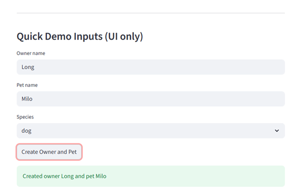
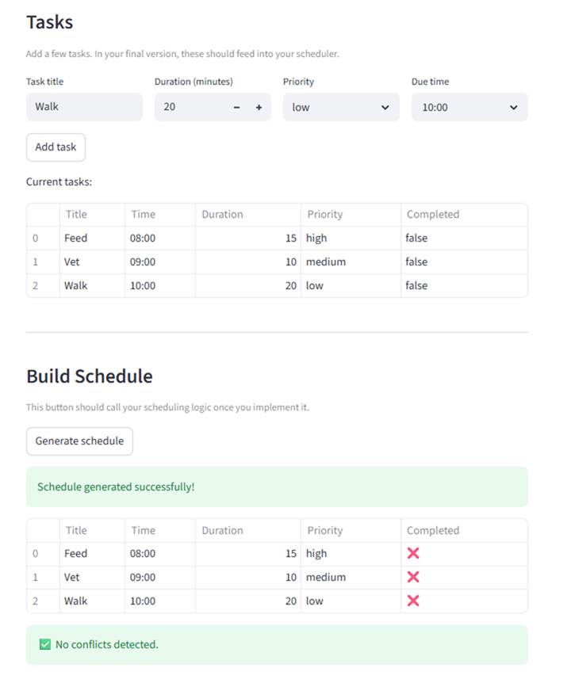
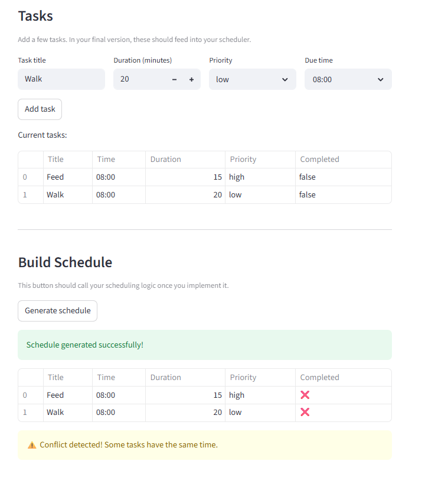
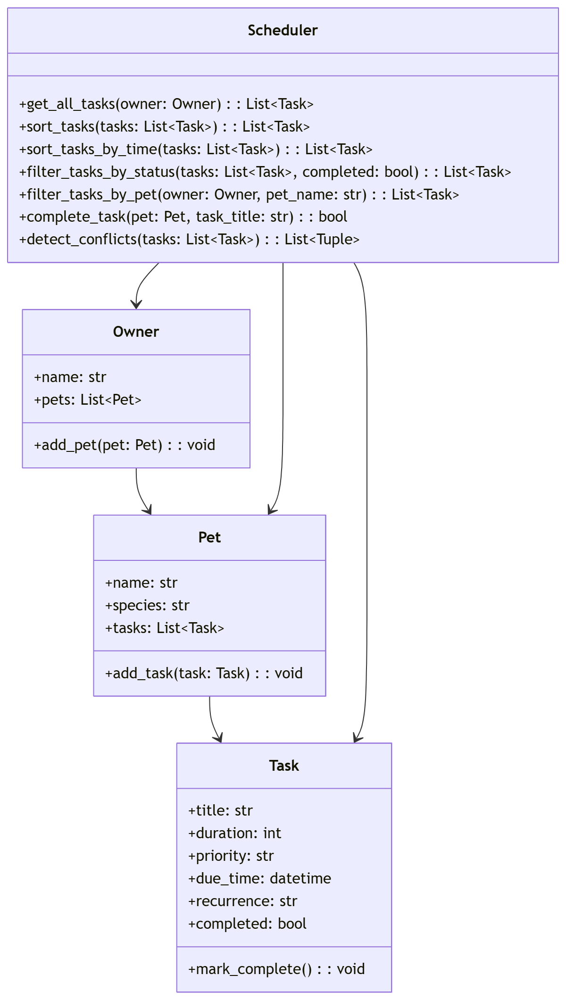
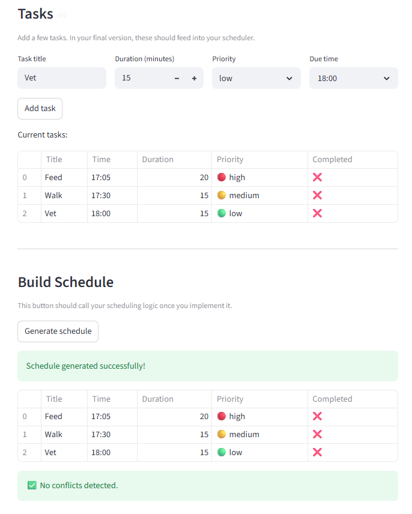

# PawPal+ (Module 2 Project)

You are building **PawPal+**, a Streamlit app that helps a pet owner plan care tasks for their pet.

## Scenario

A busy pet owner needs help staying consistent with pet care. They want an assistant that can:

- Track pet care tasks (walks, feeding, meds, enrichment, grooming, etc.)
- Consider constraints (time available, priority, owner preferences)
- Produce a daily plan and explain why it chose that plan

Your job is to design the system first (UML), then implement the logic in Python, then connect it to the Streamlit UI.

## What you will build

Your final app should:

- Let a user enter basic owner + pet info
- Let a user add/edit tasks (duration + priority at minimum)
- Generate a daily schedule/plan based on constraints and priorities
- Display the plan clearly (and ideally explain the reasoning)
- Include tests for the most important scheduling behaviors

## Getting started

### Setup

```bash
python -m venv .venv
source .venv/bin/activate  # Windows: .venv\Scripts\activate
pip install -r requirements.txt
```

### Suggested workflow

1. Read the scenario carefully and identify requirements and edge cases.
2. Draft a UML diagram (classes, attributes, methods, relationships).
3. Convert UML into Python class stubs (no logic yet).
4. Implement scheduling logic in small increments.
5. Add tests to verify key behaviors.
6. Connect your logic to the Streamlit UI in `app.py`.
7. Refine UML so it matches what you actually built.

## Phase 3: UI and Backend Integration

In this phase, the Streamlit UI (`app.py`) was connected to the backend logic (`pawpal_system.py`).

### Features implemented:

- Users can create an Owner and Pet
- Users can add tasks with duration and priority
- Tasks persist using Streamlit `session_state`
- Scheduler collects tasks from all pets
- Tasks are sorted by priority and displayed in the UI

### How to run the app

```bash
streamlit run app.py
```

## Phase 4 Features

- Sort tasks by due time
- Filter tasks by completion status and by pet
- Support recurring tasks (daily, weekly)
- Detect scheduling conflicts between tasks

## Testing PawPal

Run the automated test suite using:

```bash
python -m pytest -v
```

## Phase 4 Features

## Features

- Add pet care tasks with title, duration, priority, and due time
- Create an owner and pet in the Streamlit UI
- Generate schedules sorted by due time
- Detect scheduling conflicts when multiple tasks share the same time
- Mark tasks as completed in the backend logic
- Support recurring tasks such as daily and weekly tasks

## Demo

Below is a screenshot of the PawPal+ app interface:

 |  | 

## Testing PawPal

Run the automated tests with:

```bash
streamlit run app.py
```

## System Architecture

The final UML class diagram for PawPal+ is included in the project as 

## Challenge 4: Professional UI and Output Formatting

- Enhanced UI with color-coded priority indicators (🔴 high, 🟡 medium, 🟢 low)


